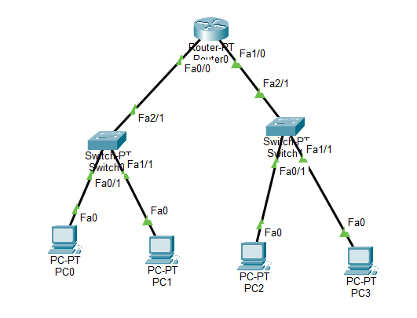

# 1.IP Addressing and Subnetting

## Overview

This project demonstrates the implementation of IP addressing and subnetting using Cisco Packet Tracer. A single network was divided into two logical subnets representing different departments, and communication between the subnets was established through a router.

## Objective

* Understand IPv4 addressing.
* Learn subnetting concepts.
* Configure IP addresses on network devices.
* Configure router interfaces.
* Verify communication within and between subnets.

## Network Design

The original network:

```text
10.0.0.0/24
```

was divided into two equal-sized subnets.

### HR Department

* Network Address: 10.0.0.0/25
* Subnet Mask: 255.255.255.128
* Host Range: 10.0.0.1 – 10.0.0.126
* Broadcast Address: 10.0.0.127

### IT Department

* Network Address: 10.0.0.128/25
* Subnet Mask: 255.255.255.128
* Host Range: 10.0.0.129 – 10.0.0.254
* Broadcast Address: 10.0.0.255

## Topology

The network consists of:

* 1 Router
* 2 Switches
* 4 PCs

The router connects both subnets and enables communication between them.



## IP Address Assignment

| Device | Interface     | IP Address | Subnet Mask     | Default Gateway |
| ------ | ------------- | ---------- | --------------- | --------------- |
| Router | Fa0/0         | 10.0.0.1   | 255.255.255.128 | -               |
| Router | Fa1/0         | 10.0.0.129 | 255.255.255.128 | -               |
| PC0    | FastEthernet0 | 10.0.0.2   | 255.255.255.128 | 10.0.0.1        |
| PC1    | FastEthernet0 | 10.0.0.3   | 255.255.255.128 | 10.0.0.1        |
| PC2    | FastEthernet0 | 10.0.0.130 | 255.255.255.128 | 10.0.0.129      |
| PC3    | FastEthernet0 | 10.0.0.131 | 255.255.255.128 | 10.0.0.129      |

## Router Configuration

```bash
enable
configure terminal

interface fa0/0
ip address 10.0.0.1 255.255.255.128
no shutdown
exit

interface fa1/0
ip address 10.0.0.129 255.255.255.128
no shutdown
exit
```

## Verification

Connectivity was verified using ICMP ping.

### Same Subnet

```text
PC0 → PC1
```

### Different Subnets

```text
PC0 → PC2
```

Successful replies confirmed proper IP addressing, subnetting, gateway configuration, and routing.

## Concepts Covered

* IPv4 Addressing
* Network and Host Identification
* Broadcast Addresses
* Subnet Masks
* CIDR Notation
* Subnetting
* Router Configuration
* Default Gateway Configuration
* Inter-Subnet Communication
* Network Connectivity Testing

## Result

The network was successfully divided into two /25 subnets. Devices were configured with appropriate IP addresses, and communication within and between the subnets was established successfully through the router.

## Tools Used

* Cisco Packet Tracer
* IPv4 Networking
